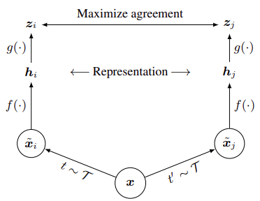
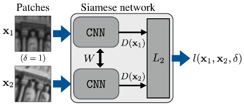
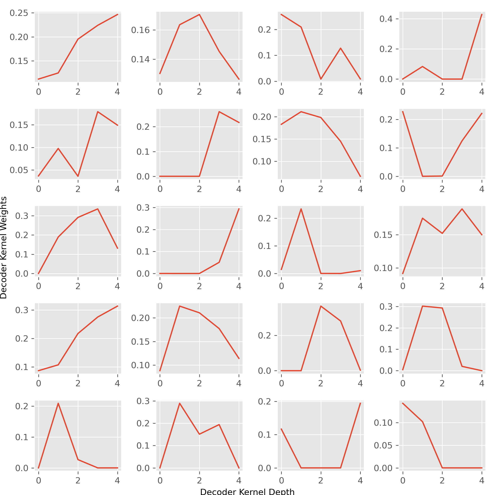
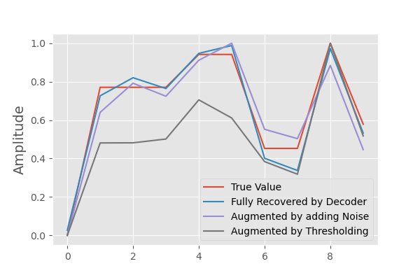
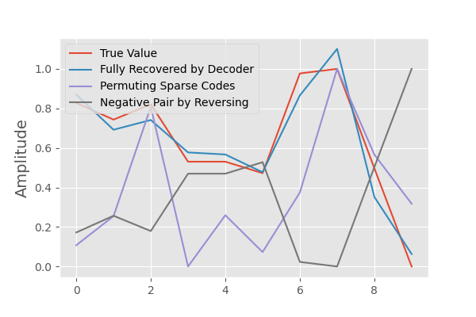
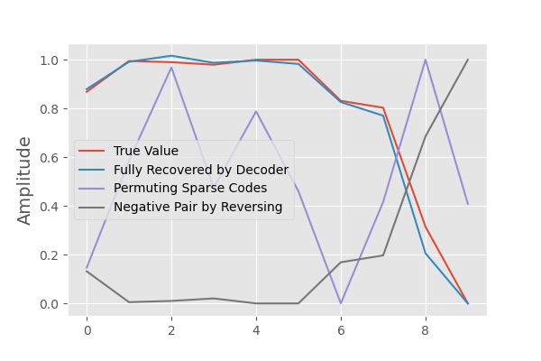
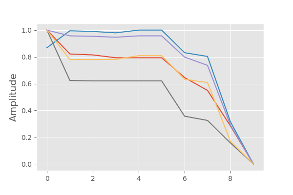
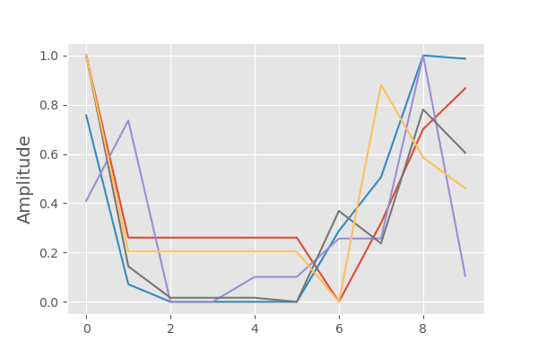
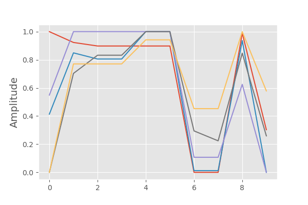

# Towards Contrastive Learning for Time-Series 

Masoud Hashemi, Elham Karami

<https://xai-360.github.io/TSCL/>


Semi-supervised learning and Contrastive Learning (CL) have gained wide attention recently, thanks to the success of recent works such as SimCLR [[1](https://arxiv.org/pdf/2002.05709.pdf), [2](https://arxiv.org/pdf/2003.04297.pdf)].

Contrastive learning is a learning paradigm where we want the model to learn similar encodings for similar objects and different encodings for non-similar objects. Therefore, we want the model to learn distinctiveness. 

Algorithms like SimCLR learn such representations by maximizing the agreement between differently augmented views of the same data example via contrastive loss in the latent space. Therefore, these algorithms depend strongly on data augmentation. Since producing meaningful augmented samples is relatively easy for images compared to other data types, contrastive learning algorithms are mostly focused on image representation. Fig. 1 shows a simple framework for contrastive learning of visual representations where $x_i$ and $x_j$ are two correlated views of $x$ generated through data augmentation. A base encoder network $f(·)$ and a projection head $g(·)$ are trained to maximize agreement between encodings of $x_i$ and $x_j$ using a contrastive loss. After training is completed, the representation $h$ is used for downstream tasks (e.g. classification).




*Fig. 1: A simple framework for contrastive learning of visual representations. Two separate data augmentation operators are sampled from the same family of augmentations and applied to each data example to obtain two correlated views. A base encoder network f(·) and a projection head g(·) are trained to maximize agreement using a contrastive loss. After training is completed, we throw away the projection head g(·) and use encoder f(·) and representation h for downstream tasks - from [[1](https://arxiv.org/pdf/2002.05709.pdf)].*


Now, how can we use contrastive learning for time series data? More specifically, how can we generate similar and non-similar pairs of time-series data type to be used for contrastive learning? In this blog post, we explore a potential solution for time-series data augmentation that extends the application of contrastive learning to time-series. The proposed solution is based on sparse dictionary learning. 

Sparse coding is a representation learning method which aims at finding a sparse representation of the input data (also known as sparse coding) in the form of a linear combination of basic elements as well as those basic elements themselves. These elements are called atoms and they compose a dictionary. Atoms in the dictionary are not required to be orthogonal, and they may be an over-complete spanning set. This problem setup also allows the dimensionality of the signals being represented to be higher than the one of the signals being observed. The above two properties lead to having seemingly redundant atoms that allow multiple representations of the same signal but also provide an improvement in sparsity and flexibility of the representation [[3](https://en.wikipedia.org/wiki/Sparse_dictionary_learning)].

The core idea of this blog post is that once a time-series instance is projected to a sparse space, one can create similar examples by changing the weights of the original components in the sparse space. Therefore, data augmentation can be done without losing semantics.

In summary, our contrastive learning framework for time-series data consists of two steps:  1) augmenting the time-series data using sparse dictionary encoding, and 2) using the contrastive loss to learn representations of the data. For contrastive learning, we use Siamese Network [[4](https://leimao.github.io/article/Siamese-Network-MNIST/), [5](http://yann.lecun.com/exdb/publis/pdf/hadsell-chopra-lecun-06.pdf)], a classic contrastive learning network. By introducing multiple input channels in the network and appropriate loss functions, the Siamese Network is able to learn similar encodings for similar inputs and different encodings for different inputs.


## Sparse Dictionary Learning

Dictionary learning aims at finding an over-complete set of dictionary atoms where data admits a sparse representation. The most important principle of dictionary learning is that the atoms are learned from the data itself, which makes this method different from DCT, Fourier transform, Wavelet transform, and other generic signal representation algorithms. The dictionaries, and the sparse representations are learned by solving the following optimization problem:
$$
argmin_{D, \alpha} \Sigma_{i=1}^K \| x_i - D\alpha_i  \|_2^2 + \lambda \| \alpha_i \|_0
$$
where we aim to represent the data $X=[x_1 , x_2, ..., x_K], x_i \in R^d$ using dictionary $D \in R^{d \times n}$ and representation $\alpha=[\alpha_1,...,\alpha_K], \alpha_i \in R^n$ such that $|X - D \alpha |^2_F$ is minimized and $\alpha$ is sparse enough. The level of sparsity is controlled with $\lambda$ which is a positive regularization constant. The $\ell_0$ constraint can be relaxed to a convex $\ell_p$ norm.

Solving this optimization problem usually is based on altering between solving for $D$ and $\alpha$, using methods like k-SVD [[6](https://sites.fas.harvard.edu/~cs278/papers/ksvd.pdf)], LASSO [[7](https://arxiv.org/pdf/0804.1302.pdf)], OMP [[8](https://openaccess.thecvf.com/content_iccv_2013/papers/Bao_Fast_Sparsity-Based_Orthogonal_2013_ICCV_paper.pdf)], ADMM [[9](http://ai.stanford.edu/~wzou/zou_bhaskar.pdf)] and FISTA [[10](https://people.rennes.inria.fr/Cedric.Herzet/Cedric.Herzet/Sparse_Seminar/Entrees/2012/11/12_A_Fast_Iterative_Shrinkage-Thresholding_Algorithmfor_Linear_Inverse_Problems_(A._Beck,_M._Teboulle)_files/Breck_2009.pdf)].

### Dictionary Learning by Winner-Take-All (WTK) Autoencoders

To learn the sparse dictionaries, we use auto-encoders and more specifically the `Winner-Take-All Autoencoders` [[11](https://papers.nips.cc/paper/5783-winner-take-all-autoencoders.pdf)]. WTA autoencoders are similar to other autoencoders except that the goal is to learn sparse representations rather than dense ones. To achieve this goal, after training the encoder the single largest hidden activity of each feature map is kept and the rest (as well as their derivatives) are set to zero. Next, the decoder reconstructs the output from the sparse feature maps. This results in a sparse representation where the sparsity level is the number of non-zero feature maps. It is noteworthy that if a shallow decoder is used, the weights of the decoder are the atoms of the dictionary.


*Fig. 2: Architecture for CONV-WTA autoencoder with spatial sparsity [[11](https://papers.nips.cc/paper/5783-winner-take-all-autoencoders.pdf)]*.


## Contrastive Learning Method

We use Dimensionality Reduction by Learning an Invariant Mapping (DrLIM)  [[5](http://yann.lecun.com/exdb/publis/pdf/hadsell-chopra-lecun-06.pdf)] for learning the representations and for unsupervised classification of the time-series.

DrLIM works by learning a family of functions $G$ that map the inputs to a manifold such that the euclidean distance between the points on the manifold $D_W(x_1, x_2) = |G_W(x_1) - G_W(x_2) |_2$ approximates the dissimilarity of the semantic meaning of $x_1$ and $x_2$. As an example, $G$ can be a neural network parametrized with $W$. To train the network, each input data point is paired with a similar and dissimilar sample. If we have access to the actual labels, similar samples can come from the same class while dissimilar samples belong to different classes. If we do not have access to the labels and the input data is an image, we can augment the input image (cropping, skewing, rotating, ...) to create a similar pair. Since creating the dissimilar pair is more challenging, a common approach is to assume that all the other samples in the training batch are dissimilar.

To train the network, the similar pair is labeled as one, $Y=1$, and the dissimilar pair is labeled as zero, $Y=0$. To minimize the distance $D_W$ between the similar samples while maximizing the distance between the dissimilar ones, DrLIM uses the following loss function: 
$$
L(W, Y, X_1, X_2) = (Y)(D_W)^2 + (1-Y)\{ min(0, m-D_W)^2 \}
$$
where $m>0$ is margin. Here, we assume $m=1$. 




*Fig. 3: Siamese Network [[4](https://leimao.github.io/article/Siamese-Network-MNIST/)]. $W$ is shared in two models*. 

## Proposed Algorithm

The proposed algorithm has two major steps:

1. Use Winner-Take-All (WTA) to learn sparse representations of sliced time-series data with a fixed length.
   - Create positive pairs (similar semantics) by thresholding and adding noise to the sparse representations.
   - Create negative pairs (dissimilar semantics) by random switching of the zero and non-zero activations in the sparse representation.
2. Use the positive and negative pairs to train a Siamese Network.

**Training Data**

Fig. 4 shows a sample of the training data which consists of Individual Conditional Expectation (ICE) plots  [[12](https://christophm.github.io/interpretable-ml-book/ice.html)] of a model trained earlier. The ICE plots display one line per instance that shows how the instance's prediction changes when a feature changes. Therefore, they can be thought of as short time-series. Although this type of data is not ideal for representing time-series, it has an important property that is required for dictionary learning: the samples have similar context.


*Fig. 4: Samples of the training data*


**Encoder** 

The encoder has two 1D-Convolutional layers with 20 filters, kernel size of 5, and ReLU activations. 

```
Model: "Encoder"
_________________________________________________________________
Layer (type)                 Output Shape              Param #   
=================================================================
conv1d_1 (Conv1D)            (None, 10, 20)            120       
_________________________________________________________________
conv1d_2 (Conv1D)            (None, 10, 20)            2020      
_________________________________________________________________
lambda_1 (Lambda)            (None, 10, 20)            0         
=================================================================
Total params: 2,140
Trainable params: 2,140
Non-trainable params: 0
```

The Lambda layer in the encoder implements the WTA:

```python
def wtall(X):
    M = K.max(X, axis=(1), keepdims=True)
    R = K.switch(K.equal(X, M), X, K.zeros_like(X))
    return R
```

**Decoder**

Decoder has one of 1D-Convolutional layer with linear activation. Since our data is simple, and also for being able to plot the dictionary atoms, we use only one layer for the decoder.

```
Model: "Decoder"
_________________________________________________________________
Layer (type)                 Output Shape              Param #   
=================================================================
conv1d_3 (Conv1D)            (None, 10, 1)             101       
_________________________________________________________________
flatten_1 (Flatten)          (None, 10)                0         
=================================================================
Total params: 101
Trainable params: 101
Non-trainable params: 0
```

Combining the encoder and decoder, the structure of the autoencoer looks like the following:

```
Model: "WTA_AutoEncoder"
_________________________________________________________________
Layer (type)                 Output Shape              Param #   
=================================================================
Encoder (Sequential)    (None, 10, 20)            2140      
_________________________________________________________________
Decoder (Sequential)    (None, 10)                101       
=================================================================
Total params: 2,241
Trainable params: 2,241
Non-trainable params: 0
```


Fig. 5 shows the decoder weights that act as the dictionary atoms.



*Fig. 5: Decoder Kernel weights which are similar to the dictionary atoms.*


There are 20 filters which create 20 dictionary atoms (creating an over-complete dictionary). The kernel width is 5 which means the length of each dictionary atom is 5 too. As can be seen in Fig. 5, each of the atoms has learned a particular behaviour/context, e.g. different ascending and descending patterns.

Fig. 6 shows some examples of the positive pairs generated using sparse dictionary coding. As can be seen in this figure, the true signal (red) and the reconstructed signal (blue) are very similar. The other two positive pairs (purple and gray) resemble the global behaviour of the original signal but they are different enough to be used for contrastive learning.




*Fig. 6: Some examples of positive pairs.*


Some examples of the generated negative pairs are shown in Fig. 7. As shown in this figure, the generated negative pairs are semantically different.





*Fig. 7: Some Examples of negative pairs.*


Using the generated negative and positive pairs, a Siamese Network is trained using Equation (2). Fig. 8 represents some examples of the most similar samples based on the encodings learned by the Siamese Network. As can be seen, the learned representations for similar samples are very close. Therefore, the representations can be used to find the most semantically similar time-series instances.








*Fig. 8: Examples of most similar samples according to the Siamese Network.*


As expected, there are some failure cases where the samples are semantically different but the learned representations are very close. Some examples are shown in Fig. 9.


*Fig. 9: Semantically different samples with similar representations in Siamese Network.*

## Discussion and conclusions

- The main goal of this blog post was to begin a discussion about the possibility of using sparse coding for time-series data augmentation. 
- We could successfully use the WTA autoencoders to learn sparse representations of time-series data, perform data augmentation, and use the generated data for Contrastive Learning.
- The framework proposed here is for proof of concept and it should be improved for real-life scenarios. For instance, the training data might not be a good representative of real time-series data, due to its limited length and size. In addition, the Siamese Network is a fully connected network (MLP), which is not the structure of choice for time-series models.